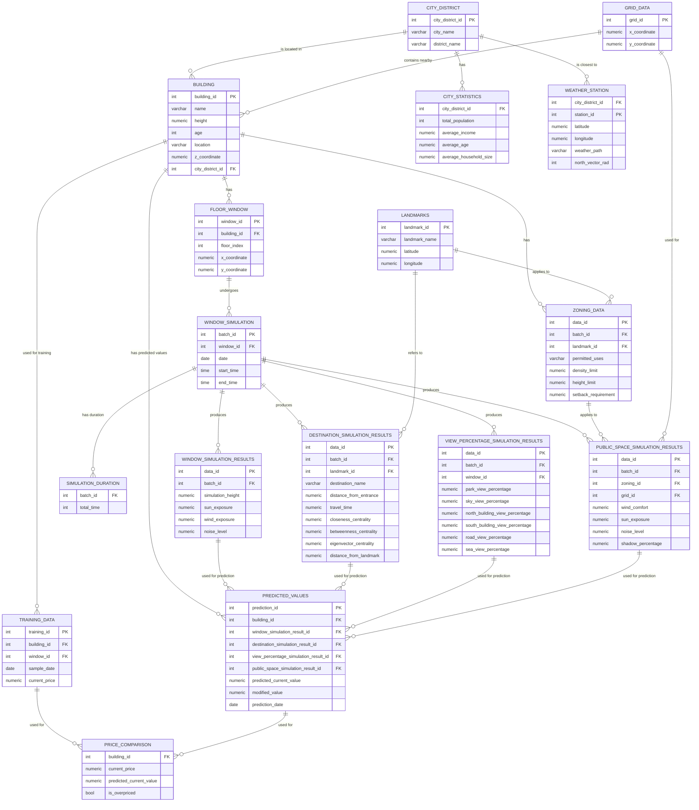

# Buying Urban Legacies through Informed Mapping

[//]: # ()

This project is a Python-based web application designed to provide an interactive interface for
visualizing and
analyzing geographic data. It leverages GIS (Geographic Information System) capabilities to allow
users to interact with
maps, perform spatial queries, and carry out geoprocessing tasks.

The application is built with a modular architecture, with separate components for handling user
interface callbacks,
core logic, and page layouts. It also includes a set of utility scripts for common tasks. The
project is
containerized using Docker for easy deployment and consistent runtime environment. It also includes
comprehensive documentation to help users understand the API endpoints, entity relationships, and
other aspects of the
application.

The application is composed of three main parts:

1. **GIS**: This part handles the import and classification of GIS information for the city of
   Logroño. It processes
   building information, block information, and grid information to create a 3D model of the city.
2. **Grasshopper Scripting**: This part uses the Ladybug plugin to simulate solar exposure, shadows,
   and views in the
   city. It creates a 3D model of Logroño based on GIS information and performs solar exposure
   simulations using
   Ladybug.
3. **PostgreSQL Database**: The results of the simulations are stored in a postgreSQL database,
   which associates
   geometry with building information and helps to query it from the web application.

### Table of Contents

- [Recopilación de información](#recopilación-de-información)
- [Tratamiento de información GIS](#tratamiento-de-información-gis)
- [Scripting en Grasshopper](#scripting-en-grasshopper)
- [Análisis de información](#análisis-de-información)

## Proceso de Trabajo

### Recolección de Información

El proceso de trabajo se bifurca en dos etapas: la recolección y el análisis de la información.
Se importa y clasifica la información GIS de la ciudad de Logroño desde el portal
Catastro.

- Edificaciones: Se importa y clasifica la información de las edificaciones de Logroño, considerando
  el
  `id_building_part` y la altura `height`. Manzanas: Se procesa la capa de edificaciones para formar
  la capa de
  manzanas, luego se clasifica la información considerando el `id_manzana`.

Se segmenta la información utilizando una
retícula (batch de ejecución), clasificándola mediante la intersección entre la retícula y las
manzanas, y luego se
intersectan las manzanas con las edificaciones. Esto nos permite determinar la pertenencia del
edificio `id_building_part` a la manzana `id_manzana` y la pertenencia de la manzana `id_manzana` a
la
retícula `id_batch`. Retícula: Se crea una retícula de 100x100 metros y se clasifica la información
considerando
el `id_batch`.

### Preparación de la Información

Se utiliza el plugin Ladybug para simular soleamiento, sombras y vistas. Epw map
locator: https://www.ladybug.tools/epwmap/
Se crea un modelo tridimensional de Logroño a partir de la información GIS, considerando las plantas
y alturas de las
edificaciones.
Se realiza una simulación de exposición solar con Ladybug, considerando las sombras proyectadas por
los edificios.

Se organiza la información obtenida en la simulación, la cual debe contener el `id_building_part`
del edificio, la
altura `height`, la orientación de la fachada `orientation` (según 24 vectores en el plano XY), y la
radiación
recibida en la fachada `radiation`. La matriz de puntos (centroid mesh faces) se almacena en un
archivo `json` para su
uso posterior.

- Se exporta el modelo utilizando Speckle systems y se exporta la información a la base de datos
  mediante PostgreSQL.

### Análisis de Información

El análisis se realiza en dos partes: para viviendas y para locales comerciales. Para optimizar el
tiempo, se utiliza el
volumen completo del modelo para obstaculizar el análisis de las fachadas de los edificios
exclusivamente. No se calcula
la radiación en las cubiertas, lo cual sería objeto de un estudio posterior.

- Exposición Solar: Se calcula la radiación en verano e invierno, considerando la posición del sol (
  radiación mínima,
  máxima y promedio). Los resultados se almacenan en `radiation_winter`, `radiation_summer` y
  `radiation_average`.
- Exposición a Sombras: Se calculan las sombras proyectadas por los edificios en los periodos de
  radiación mínima,
  máxima y promedio. Los resultados se almacenan en `shadow_winter`, `shadow_summer` y
  `shadow_average`.
- Exposición a Vistas: Se calculan las vistas en los periodos de radiación mínima, máxima y
  promedio. Los resultados se
  almacenan en `percent_view`, `percent_type_view`.

### Productos Resultantes

Los productos resultantes se dividen en dos partes: la información obtenida para viviendas y la
información obtenida
para locales comerciales.

- Productos para Viviendas: Los cálculos obtenidos se clasifican en dos tipos, los cálculos de
  radiación y los cálculos
  de sombras. Estos se utilizan para el estudio informado del valor de los activos residenciales.
  Con la información de
  antigüedad de la edificación, soleamiento, sombras, vistas, centralidad y ruido, podemos obtener
  un valor teórico de
  los activos residenciales.

- Productos para Locales Comerciales: Los cálculos obtenidos se clasifican en dos tipos, los
  cálculos de radiación y los
  cálculos de sombras. Estos se utilizan para el estudio informado del valor de los activos
  comerciales. Con la
  información de antigüedad de la edificación, soleamiento, sombras, vistas, ruido, y accesibilidad,
  podemos obtener un
  valor teórico de los activos comerciales.

La información para su interacción se presenta en una webapp desarrollada en Dash y Django,
utilizando Speckle para la
visualización tridimensional de la ciudad (o dash-deck) y Dash para la comparación y explicación de
los resultados.

## Project Structure

The project is organized into several directories and files, each serving a specific purpose. Here
is an overview of
the main components:

### Main files

- `callbacks/`: Contains callback modal and response Python scripts.
    - `callback_modal.py`: Defines the modal (popup) windows used in the application.
    - `callback_response.py`: Handles the responses to user actions in the application.
- `callbacks_core.py`: Contains the main logic for how the application responds to user actions.
- `Dockerfile`: Defines the environment in which the application runs in a Docker container.
- `docs/`: Contains documentation files for the project.
    - `api-endpoints.md`: Documentation of the API endpoints provided by the application.
    - `entity-relations.md`: Explanation of the relationships between differpip install dash-deckent
      entities in the
      application.
    - `wiki-python.md`: A wiki for Python-related topics in the project.
    - `wiki-grasshopper.md`: A wiki for Grasshopper-related topics in the project.
- `gis/`: Contains Geographic Information System (GIS) related scripts.
- `main.py`: The main script to run the project.
- `pages/`: Contains layout Python scripts.
    - `layout_default.py`: Defines the default layout for the application.
    - `layout_grid.py`: Defines a grid-based layout for the application.
    - `layout_landing.py`: Defines the layout for the landing page of the application.
    - `layout_modals.py`: Defines the layout for modal windows in the application.
- `README.md`: Provides an overview of the project and instructions for installation, usage, and
  contribution.
- `requirements.txt`: Lists the Python package dependencies for the project.
- `static/`: Contains static files like CSS, JavaScript, and image files.
- `utils/`: Contains utility scripts that provide various helper functions used throughout the
  application.

## Database Structure

In this project, PostgreSQL plays a crucial role as the primary database system. It is used to store
and manage various
types of data related to the construction project. Here are some of its key roles:

1. **Storing Geometry Data**: PostgreSQL is used to store the geometry data created by Rhino
   Compute. Each piece of
   geometry is assigned a unique ID, which is managed by Speckle and stored in the PostgreSQL
   database.

2. **Associating Geometry with Material Lifecycle Data**: The PostgreSQL database associates each
   piece of geometry (
   identified by its unique ID) with its corresponding material lifecycle data. This allows the
   system to track the
   lifecycle of each material used in the construction project.

3. **Storing User Data**: The database stores information about the users of the system, including
   their IDs and names.
   This allows the system to track which user is making requests, owns construction projects, and
   makes parameter
   variations.

4. **Storing Parameter Variations**: The database stores the variations of parameters for the
   constructive systems. Each
   variation has a unique ID, a parameter name, and a value. It also stores the user ID to track
   which user made which
   parameter variations.

5. **Storing Construction Project Data**: The database stores information about the construction
   projects, including
   their IDs, names, start and end dates, user IDs, and constructive system IDs. This allows the
   system to track which
   user owns which construction project and which constructive system is used in each project.

6. **Storing Constructive System Data**: The database stores information about the constructive
   systems, including their
   IDs, names, and descriptions. This allows the system to track which constructive system is used
   in each construction
   project and which materials are used in each constructive system.

In summary, PostgreSQL is used to store and manage all the data in the system, making it a crucial
component of the
project.

## Deployment

El despliegue de los dos contenedores (Postgres y Webapp python) se realiza mediante Docker y Docker
Compose. Se
utiliza Azure.

- Contenedores de Docker: `docker-compose up`
- Contenedor de Postgres: `docker run --name postgres -e POSTGRES_PASSWORD=postgres -d postgres`
- Webapp de Azure: https://dash-deck.azurewebsites.net/

## Roadmap

Based on the provided information, here is a clear roadmap for your project:

1. **Must Have**
    - Define landmarks or hot locations and provide a walk time class. Use sampling instead of
      calculating all points.
    - Add a percentage type of view.
    - Fix text related to content in Dash.
    - Implement a working development bar with datapoints stored in the database.
    - Delete one of the tabs and improve the playground. It should contain all the analysis in some
      form.

2. **Potential Functionalities**
    - Add the possibility to generate a report about the selected analysis.
    - Consider using Speckle to embed specific properties in online reports.
    - Potentially install Speckle on a server/container.
    - Implement a cluster analysis and provide a lock view about the specific building. This
      requires isolation of a
      specific floor, then also isolate the nearby building or the current building.

3. **Conclusions**
    - Extract conclusions by modifying the existing three-dimensional morphology of the city.

4. **Low Priority**
    - Manage user database. Consider using Django, even though it seems inevitable to embed the Dash
      application within
      Django. Alternatively, you could use Flask login and manage implementations, but be aware that
      Flask login may not
      be secure enough.

Remember, this is a roadmap and it's subject to change based on the project's needs and priorities.
It's important to
regularly review and update it as the project progresses.

https://community.plotly.com/t/django-dash-new-improved-relationship-authentication/71273

# TODO:

# Añadir matriz con la distribución (curve) de cada variable y la posición de la variable

# seleccionada

"""
Load section:

- Bake urban data in postgres and read geojson from server not in local (query done)
- Display real data in tables

Home section:

- Bake the analytic example models in Speckle and link them to the app

Assets section:

- Create the functionality to compare your current performance_assets at scale
  [X]- Add graphs to show more valuable information -> Current graph must display the analysis
  types not the cities (it filter when the table value is selected). Add graph about building age,
  building type, etc.
- Filter table data with the parallel graph

---- OPTIONAL ----
Explore preferences:

- Add graphs to filter the data
- Add a kind of "search copilot" functionality to filter the data by natural language
  """
