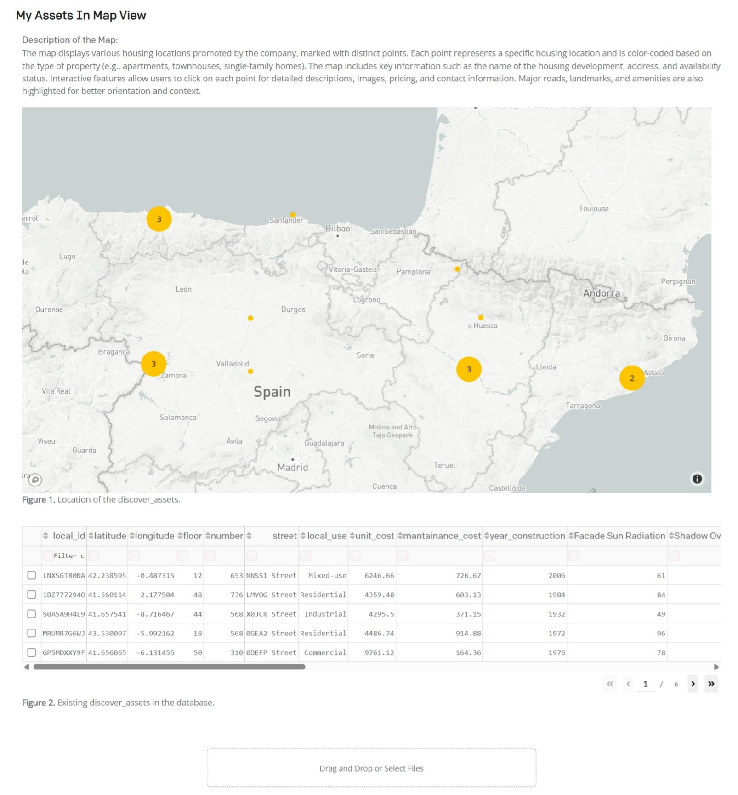

# Unlocking Business Intelligence for Real State with Large Scale Comparatives

[//]: # ()


This project is a Python-based web application designed to provide an interactive interface for
visualizing and
analyzing geographic data. It leverages GIS (Geographic Information System) capabilities to allow
users to interact with
maps, perform spatial queries, and carry out geoprocessing tasks.

The application is built with a modular architecture, with separate components for handling user
interface callbacks,
core logic, and page layouts. It also includes a set of utility scripts for common tasks. The
project is
containerized using Docker for easy deployment and consistent runtime environment. It also includes
comprehensive documentation to help users understand the API endpoints, entity relationships, and
other aspects of the
application.

### Table of Contents

- [Overview](#overview)
    - [Problem Statement](#problem-statement): Describes the challenges and issues the project aims
      to address.
    - [Business Intelligence](#business-intelligence): Details the features and benefits of the
      platform for urban stakeholders.
    - [Software Architecture](#software-architecture): Outlines the modular architecture and
      technologies used in the project.
    - [Scope of the Project](#scope-of-the-project): Defines the objectives and goals of the
      project.
- [Project Structure](#project-structure): Provides an overview of the project's directory and file
  organization.
- [Input Data](#input-data): Describes the types of data used in the project and their sources.
- [User Interface](#user-interface): Explains the design and functionality of the application's user
  interface.
- [Core Workflows](#core-workflows): Details the main processes and operations of the project.
    - [GIS Data Processing](#gis-data-processing): Covers the steps for importing and processing GIS
      data.
    - [Data Processing](#data-processing): Describes the analysis and processing of data for
      residential and commercial properties.
    - [Business Intelligence](#business-intelligence-1): Explains the insights and analysis provided
      by the platform.
- [Relational Database](#relational-database): Details the database structure and its role in the
  project.
- [Conclusion](#conclusion): Summarizes the project's outcomes and future directions.
    - [Deployment](#deployment): Provides information on how to deploy the project.
    - [Next steps](#next-): Outlines potential future enhancements and improvements.

## Overview

### Problem Statement

Current urban data analysis tools often fail to integrate environmental factors, building
characteristics, and asset valuation in a comprehensive and accessible way. This limits stakeholders
such as architects, urban planners, and real estate developers from making informed decisions based
on real-world geographic and environmental data. "Buying Urban Legacies through Informed Mapping"
addresses this gap by providing an interactive web platform that integrates GIS, 3D modeling, and
environmental simulations to analyze the value of residential and commercial assets in the city of
Logroño.

### Business Intelligence

The platform offers a range of features to support urban stakeholders in making informed decisions
about asset valuation and urban development. Users can visualize GIS-based 3D models of Logroño,
simulate environmental factors like solar exposure and shadows, and compare different properties
based on various criteria. The platform's analysis covers residential and commercial properties,
incorporating factors such as building age, noise levels, and solar exposure to estimate asset
value. By providing an interactive interface for exploring and comparing assets, the platform
empowers users to optimize planning, investment, and policy decisions in urban development.


*Diagram 1: Business Intelligence for Urban Data Analysis*

### Project Architecture

The platform is modular, with a **Dash**-based user interface for interactive data visualization and
analysis. **GIS processing** manages geospatial data import and classification, while **Grasshopper
** and the **Ladybug plugin** perform solar and shadow simulations on 3D models. A **PostgreSQL**
database stores simulation results, building data, and user queries, with **Speckle** facilitating
3D visualization. The entire application is containerized using **Docker** and deployed on **Azure**
for cloud accessibility, enabling scalable and consistent runtime environments.

### Scope of the Project

This project aims to provide a robust platform for urban data analysis and asset valuation in
Logroño. It will offer users the ability to visualize GIS-based 3D urban models, simulate
environmental factors like solar exposure and shadows, and perform geospatial queries. The
platform's analysis will cover residential and commercial properties, incorporating variables such
as building age, noise levels, and solar exposure to estimate asset value. Additionally, users will
benefit from an interactive interface for comparing assets, making the platform a valuable tool for
urban planning and real estate development.

## Project Structure

The project is organized into several directories and files, each serving a specific purpose. The
application is composed of three main parts:

- *GIS**: This part handles the import and classification of GIS information for the city of
  Logroño. It processes
  building information, block information, and grid information to create a 3D model of the city.
- **Grasshopper Scripting**: This part uses the Ladybug plugin to simulate solar exposure, shadows,
  and views in the
  city. It creates a 3D model of Logroño based on GIS information and performs solar exposure
  simulations using
  Ladybug.
- **PostgreSQL Database**: The results of the simulations are stored in a postgreSQL database,
  which associates
  geometry with building information and helps to query it from the web application.

```plaintext
src/
├── views/
│   ├── load_assets/
│   │   └── layout_load.py
│   ├── default/
│   │   └── _deprecated/
│   └── ...
├── main.py
├── pages/
│   ├── layout_default.py
│   ├── layout_grid.py
│   ├── layout_landing.py
│   ├── layout_modals.py
│   └── ...
├── callbacks/
│   ├── callback_modal.py
│   ├── callback_response.py
│   └── ...
├── utils/
│   └── ...
├── static/
│   └── ...
├── docs/
│   ├── api-endpoints.md
│   ├── entity-relations.md
│   ├── wiki-python.md
│   ├── wiki-grasshopper.md
│   └── ...
├── Dockerfile
├── requirements.txt
└── README.md
```

In detail:

- `callbacks/`: Contains callback modal and response Python scripts.
- `main.py`: The main script to run the project.
- `pages/`: Contains layout Python scripts.
- `static/`: Contains static files like CSS, JavaScript, and image files.
- `utils/`: Contains utility scripts that provide various helper functions used throughout the
  application.

### Input Data

The input data for this project includes GIS data for the city of Logroño, which is processed to
create a 3D model of the city. The GIS data includes information about buildings, blocks, and grids
in the city. This data is used to simulate solar exposure, shadows, and views in the city, which are
then stored in a PostgreSQL database for further analysis.


*Figure 1: 3D Model of Valencia from Grasshopper.*


*Figure 2: GIS Data Processing in QGIS.*

### User Interface

The user interface of the application is built using Dash, a Python web framework for building
analytical web applications. The interface allows users to interact with the 3D model of Logroño,
view simulation results, and compare different properties based on various factors like solar
exposure, shadows, and views. The interface is designed to be intuitive and user-friendly, with
interactive elements for exploring the data and making informed decisions.

## Core Workflows

### Data Creation

El proceso de trabajo se bifurca en dos etapas: la recolección y el análisis de la información.
Se importa y clasifica la información GIS de la ciudad de Logroño desde el portal
Catastro.

- Edificaciones: Se importa y clasifica la información de las edificaciones de Logroño, considerando
  el
  `id_building_part` y la altura `height`. Manzanas: Se procesa la capa de edificaciones para formar
  la capa de
  manzanas, luego se clasifica la información considerando el `id_manzana`.

Se segmenta la información utilizando una
retícula (batch de ejecución), clasificándola mediante la intersección entre la retícula y las
manzanas, y luego se
intersectan las manzanas con las edificaciones. Esto nos permite determinar la pertenencia del
edificio `id_building_part` a la manzana `id_manzana` y la pertenencia de la manzana `id_manzana` a
la
retícula `id_batch`. Retícula: Se crea una retícula de 100x100 metros y se clasifica la información
considerando
el `id_batch`.

Se utiliza el plugin Ladybug para simular soleamiento, sombras y vistas. Epw map
locator: https://www.ladybug.tools/epwmap/
Se crea un modelo tridimensional de Logroño a partir de la información GIS, considerando las plantas
y alturas de las
edificaciones.
Se realiza una simulación de exposición solar con Ladybug, considerando las sombras proyectadas por
los edificios.

Se organiza la información obtenida en la simulación, la cual debe contener el `id_building_part`
del edificio, la
altura `height`, la orientación de la fachada `orientation` (según 24 vectores en el plano XY), y la
radiación
recibida en la fachada `radiation`. La matriz de puntos (centroid mesh faces) se almacena en un
archivo `json` para su
uso posterior.


*Figure 1: 3D Model of Valencia from Grasshopper.*


*Figure 1: 3D Model of Valencia from Grasshopper.*

### Data Warehousing (ETL)

El análisis se realiza en dos partes: para viviendas y para locales comerciales. Para optimizar el
tiempo, se utiliza el
volumen completo del modelo para obstaculizar el análisis de las fachadas de los edificios
exclusivamente. No se calcula
la radiación en las cubiertas, lo cual sería objeto de un estudio posterior.

- Exposición Solar: Se calcula la radiación en verano e invierno, considerando la posición del sol (
  radiación mínima,
  máxima y promedio). Los resultados se almacenan en `radiation_winter`, `radiation_summer` y
  `radiation_average`.
- Exposición a Sombras: Se calculan las sombras proyectadas por los edificios en los periodos de
  radiación mínima,
  máxima y promedio. Los resultados se almacenan en `shadow_winter`, `shadow_summer` y
  `shadow_average`.
- Exposición a Vistas: Se calculan las vistas en los periodos de radiación mínima, máxima y
  promedio. Los resultados se
  almacenan en `percent_view`, `percent_type_view`.


*Figure 1: 3D Model of Valencia from Grasshopper.*

### Business Logic

In this project, PostgreSQL plays a crucial role as the primary database system. It is used to store
and manage various
types of data related to the construction project. Here are some of its key roles:

- **Storing Geometry Data**: PostgreSQL is used to store the geometry data created by Rhino
  Compute. Each piece of
  geometry is assigned a unique ID, which is managed by Speckle and stored in the PostgreSQL
  database.

- **Associating Geometry with Material Lifecycle Data**: The PostgreSQL database associates each
  piece of geometry (
  identified by its unique ID) with its corresponding material lifecycle data. This allows the
  system to track the
  lifecycle of each material used in the construction project.

- **Storing User Data**: The database stores information about the users of the system, including
  their IDs and names.
  This allows the system to track which user is making requests, owns construction projects, and
  makes parameter
  variations.

- **Storing Parameter Variations**: The database stores the variations of parameters for the
  constructive systems. Each
  variation has a unique ID, a parameter name, and a value. It also stores the user ID to track
  which user made which
  parameter variations.

- **Storing Construction Project Data**: The database stores information about the construction
  projects, including
  their IDs, names, start and end dates, user IDs, and constructive system IDs. This allows the
  system to track which
  user owns which construction project and which constructive system is used in each project.

- **Storing Constructive System Data**: The database stores information about the constructive
  systems, including their
  IDs, names, and descriptions. This allows the system to track which constructive system is used
  in each construction
  project and which materials are used in each constructive system.


*Diagram 1: Entity-Relationship Diagram for the PostgreSQL Database*

In this diagram:

- **City and Building Information**:
    - `city_district`: Contains information about the city districts.
    - `city_statistics`: Contains statistical information about the city districts.
    - `weather_station`: Contains information about the weather stations in the city.
    - `building`: Contains information about the buildings, including their height, age, and
      location.
    - `floor_window`: Contains information about the windows on each floor of the buildings.
- **Simulation Data**:
    - `window_simulation`: Contains information about the window simulations, including the date and
      time.
    - `window_simulation_results`: Contains the results of the window simulations, including sun
      exposure and noise level.
    - `simulation_duration`: Contains the total time of the simulations.
    - `zoning_data`: Contains zoning information, including permitted uses and density limits.
    - `destination_simulation_results`: Contains the results of the destination simulations,
      including travel time and centrality measures.
    - `view_percentage_simulation_results`: Contains the results of the view percentage simulations,
      including park and sky view percentages.
    - `public_space_simulation_results`: Contains the results of the public space simulations,
      including wind comfort and sun exposure.
- **Training and Prediction Data**:
    - `training_data`: Contains training data used for model training, including current prices.
    - `predicted_values`: Contains predicted values from the simulations.
    - `price_comparison`: Contains price comparison data, including whether a building is
      overpriced.

### Business Intelligence Services

Los productos resultantes se dividen en dos partes: la información obtenida para viviendas y la
información obtenida
para locales comerciales.

- Productos para Viviendas: Los cálculos obtenidos se clasifican en dos tipos, los cálculos de
  radiación y los cálculos
  de sombras. Estos se utilizan para el estudio informado del valor de los activos residenciales.
  Con la información de
  antigüedad de la edificación, soleamiento, sombras, vistas, centralidad y ruido, podemos obtener
  un valor teórico de
  los activos residenciales.

- Productos para Locales Comerciales: Los cálculos obtenidos se clasifican en dos tipos, los
  cálculos de radiación y los
  cálculos de sombras. Estos se utilizan para el estudio informado del valor de los activos
  comerciales. Con la
  información de antigüedad de la edificación, soleamiento, sombras, vistas, ruido, y accesibilidad,
  podemos obtener un
  valor teórico de los activos comerciales.


*Figure 1: 3D Model of Valencia from Grasshopper.*

In this image:

- **Radiation Calculations**: The radiation calculations are used to estimate the solar exposure of
  residential and commercial properties. This information is crucial for understanding the value of
  assets in terms of sunlight exposure.
- **Shadow Calculations**: The shadow calculations are used to estimate the shadow exposure of
  residential and commercial properties. This information is essential for understanding the value
  of assets in terms of shadow exposure.
- **View Calculations**: The view calculations are used to estimate the view exposure of residential
  and commercial properties. This information is important for understanding the value of assets in
  terms of views.
- **Noise Calculations**: The noise calculations are used to estimate the noise exposure of
  residential and commercial properties. This information is critical for understanding the value of
  assets in terms of noise pollution.

## Conclusion

The project "Buying Urban Legacies through Informed Mapping" aims to provide a comprehensive
platform for urban data analysis and asset valuation in Logroño. By integrating GIS, 3D modeling,
and
environmental simulations, the platform offers urban stakeholders a powerful tool for making
informed
decisions about urban development and real estate investment. The project's modular architecture,
user-friendly interface, and robust database structure make it a valuable resource for architects,
urban planners, and real estate developers looking to optimize their planning, investment, and
policy
decisions.

### Next steps

Based on the provided information, here is a clear roadmap for your project:

1. **Must Have**
    - Define landmarks or hot locations and provide a walk time class. Use sampling instead of
      calculating all points.
    - Add a percentage type of view.
    - Fix text related to content in Dash.
    - Implement a working development bar with datapoints stored in the database.
    - Delete one of the tabs and improve the playground. It should contain all the analysis in some
      form.

2. **Potential Functionalities**
    - Add the possibility to generate a report about the selected analysis.
    - Consider using Speckle to embed specific properties in online reports.
    - Potentially install Speckle on a server/container.
    - Implement a cluster analysis and provide a lock view about the specific building. This
      requires isolation of a
      specific floor, then also isolate the nearby building or the current building.

3. **Conclusions**
    - Extract conclusions by modifying the existing three-dimensional morphology of the city.

4. **Low Priority**
    - Manage user database. Consider using Django, even though it seems inevitable to embed the Dash
      application within
      Django. Alternatively, you could use Flask login and manage implementations, but be aware that
      Flask login may not
      be secure enough.
