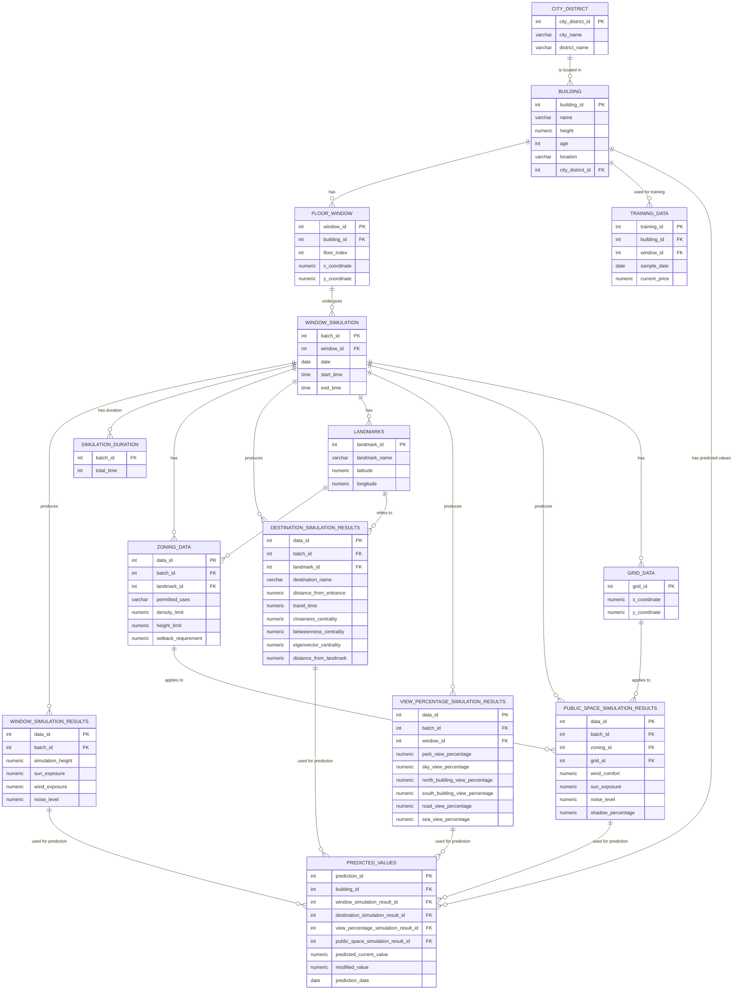

```mermaid
erDiagram
    CITY_DISTRICT ||--o{ BUILDING: "is located in"
    BUILDING ||--o{ FLOOR_WINDOW: "has"
    BUILDING ||--o{ TRAINING_DATA: "used for training"
    BUILDING ||--o{ PREDICTED_VALUES: "has predicted values"
    FLOOR_WINDOW ||--o{ WINDOW_SIMULATION: "undergoes"
    WINDOW_SIMULATION ||--o{ WINDOW_SIMULATION_RESULTS: "produces"
    WINDOW_SIMULATION_RESULTS ||--o{ PREDICTED_VALUES: "used for prediction"
    WINDOW_SIMULATION ||--o{ SIMULATION_DURATION: "has duration"
    WINDOW_SIMULATION ||--o{ ZONING_DATA: "has"
    WINDOW_SIMULATION ||--o{ DESTINATION_SIMULATION_RESULTS: "produces"
    DESTINATION_SIMULATION_RESULTS ||--o{ PREDICTED_VALUES: "used for prediction"
    WINDOW_SIMULATION ||--o{ LANDMARKS: "has"
    WINDOW_SIMULATION ||--o{ VIEW_PERCENTAGE_SIMULATION_RESULTS: "produces"
    VIEW_PERCENTAGE_SIMULATION_RESULTS ||--o{ PREDICTED_VALUES: "used for prediction"
    WINDOW_SIMULATION ||--o{ PUBLIC_SPACE_SIMULATION_RESULTS: "produces"
    PUBLIC_SPACE_SIMULATION_RESULTS ||--o{ PREDICTED_VALUES: "used for prediction"
    WINDOW_SIMULATION ||--o{ GRID_DATA: "has"
    LANDMARKS ||--o{ ZONING_DATA: "applies to"
    LANDMARKS ||--o{ DESTINATION_SIMULATION_RESULTS: "refers to"
    ZONING_DATA ||--o{ PUBLIC_SPACE_SIMULATION_RESULTS: "applies to"
    GRID_DATA ||--o{ PUBLIC_SPACE_SIMULATION_RESULTS: "applies to"

%%BUILDING_SIMULATION_SUMMARY ||--o{ BUILDING : "based on"
%%BUILDING_SIMULATION_SUMMARY ||--o{ WINDOW_SIMULATION_RESULTS : "based on"

%%LANDMARK_PROXIMITY ||--o{ BUILDING : "based on"
%%LANDMARK_PROXIMITY ||--o{ LANDMARKS : "based on"
%%LANDMARK_PROXIMITY ||--o{ DESTINATION_SIMULATION_RESULTS : "based on"

%%PREDICTED_VALUES_SUMMARY ||--o{ BUILDING : "based on"
%%PREDICTED_VALUES_SUMMARY ||--o{ PREDICTED_VALUES : "based on"

    CITY_DISTRICT {
        int city_district_id PK
        varchar city_name
        varchar district_name
    }

    BUILDING {
        int building_id PK
        varchar name
        numeric height
        int age
        varchar location
        int city_district_id FK
    }

    FLOOR_WINDOW {
        int window_id PK
        int building_id FK
        int floor_index
        numeric x_coordinate
        numeric y_coordinate
    }

    WINDOW_SIMULATION {
        int batch_id PK
        int window_id FK
        date date
        time start_time
        time end_time
    }

    WINDOW_SIMULATION_RESULTS {
        int data_id PK
        int batch_id FK
        numeric simulation_height
        numeric sun_exposure
        numeric wind_exposure
        numeric noise_level
    }

    SIMULATION_DURATION {
        int batch_id FK
        int total_time
    }

    ZONING_DATA {
        int data_id PK
        int batch_id FK
        int landmark_id FK
        varchar permitted_uses
        numeric density_limit
        numeric height_limit
        numeric setback_requirement
    }

    DESTINATION_SIMULATION_RESULTS {
        int data_id PK
        int batch_id FK
        int landmark_id FK
        varchar destination_name
        numeric distance_from_entrance
        numeric travel_time
        numeric closeness_centrality
        numeric betweenness_centrality
        numeric eigenvector_centrality
        numeric distance_from_landmark
    }

    LANDMARKS {
        int landmark_id PK
        varchar landmark_name
        numeric latitude
        numeric longitude
    }

    VIEW_PERCENTAGE_SIMULATION_RESULTS {
        int data_id PK
        int batch_id FK
        int window_id FK
        numeric park_view_percentage
        numeric sky_view_percentage
        numeric north_building_view_percentage
        numeric south_building_view_percentage
        numeric road_view_percentage
        numeric sea_view_percentage
    }

    PUBLIC_SPACE_SIMULATION_RESULTS {
        int data_id PK
        int batch_id FK
        int zoning_id FK
        int grid_id FK
        numeric wind_comfort
        numeric sun_exposure
        numeric noise_level
        numeric shadow_percentage
    }

    GRID_DATA {
        int grid_id PK
        numeric x_coordinate
        numeric y_coordinate
    }

    TRAINING_DATA {
        int training_id PK
        int building_id FK
        int window_id FK
        date sample_date
        numeric current_price
    }

    PREDICTED_VALUES {
        int prediction_id PK
        int building_id FK
        int window_simulation_result_id FK
        int destination_simulation_result_id FK
        int view_percentage_simulation_result_id FK
        int public_space_simulation_result_id FK
        numeric predicted_current_value
        numeric modified_value
        date prediction_date
    }
```